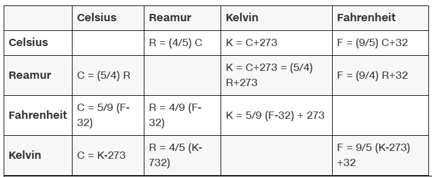

# Topics 1: Pseudocode

## Pseudocode

Pseudocode adalah cara penulisan algoritma dalam bahasa yang mudah dipahami manusia, mirip bahasa sehari-hari, tanpa terikat aturan sintaksis bahasa pemrograman tertentu. Ini digunakan untuk merancang dan menjelaskan logika program sebelum diterjemahkan ke kode asli.

Contoh :

```bash
 ALGORITMA HitungLuasPersegi
MULAI
 INPUT panjang_sisi
 luas = panjang_sisi * panjang_sisi
 TAMPILKAN luas
SELESAI
```

### Tugas Pseudocode : Temperature Converter in Pseudocode

Tulis Pseudocode (alur logika non-kode) yang mencakup:
- konversi suhu dari **Celcius** ke **Fahrenheit** dan sebaliknya
- konversi suhu dari **Celcius** ke **Reamur** dan sebaliknya
- konversi suhu dari **Celcius** ke **Kelvin** dan sebaliknya 

**Penyelesaian**



