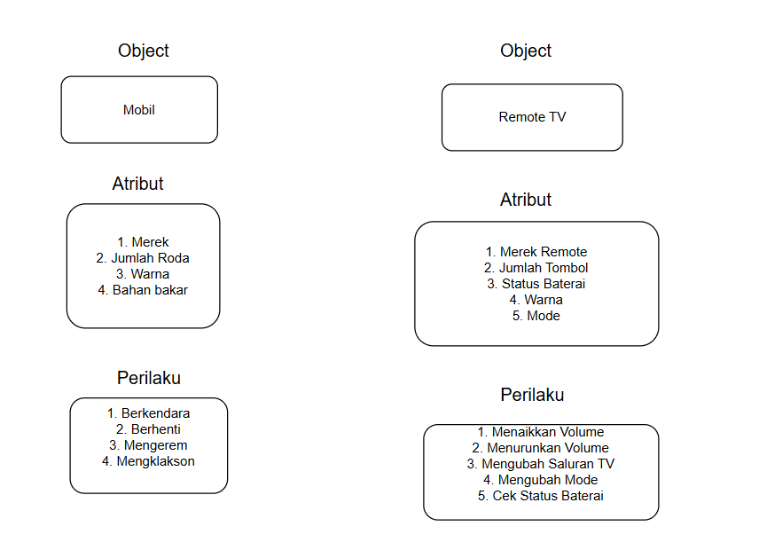

# Topics 1: Pseudocode

Pseudocode adalah cara penulisan algoritma dalam bahasa yang mudah dipahami manusia, mirip bahasa sehari-hari, tanpa terikat aturan sintaksis bahasa pemrograman tertentu. Ini digunakan untuk merancang dan menjelaskan logika program sebelum diterjemahkan ke kode asli.

Contoh :

```bash
 ALGORITMA HitungLuasPersegi
MULAI
 INPUT panjang_sisi
 luas = panjang_sisi * panjang_sisi
 TAMPILKAN luas
SELESAI
```

## Tugas Pseudocode : Temperature Converter in Pseudocode

Tulis Pseudocode (alur logika non-kode) yang mencakup:

- konversi suhu dari **Celcius** ke **Fahrenheit** dan sebaliknya
- konversi suhu dari **Celcius** ke **Reamur** dan sebaliknya
- konversi suhu dari **Celcius** ke **Kelvin** dan sebaliknya

**Penyelesaian**


Penulisan Pseudocode :

```bash
 ALGORITMA Temperature

MASUKAN TemperatureCelsius (bilangan real)

DEKLARASI toFahrenheit, toReamur, toKelvin (bilangan real)

// 1. Konversi Celsius ke Fahrenheit

toFahrenheit ← (TemperatureCelsius \* 9/5) + 32

// 2. Konversi Celsius ke Reamur

toReamur ← TemperatureCelsius \* 4/5

// 3. Konversi Celsius ke Kelvin

toKelvin ← TemperatureCelsius + 273.15

KELUARAN "Suhu dalam Fahrenheit: ", toFahrenheit

KELUARAN "Suhu dalam Reamur: ", toReamur

KELUARAN "Suhu dalam Kelvin: ", toKelvin

SELESAI
```

# Topics 2: OOP (Object Oriented Programing)

Object-Oriented Programming (OOP) adalah paradigma pemrograman yang mengorganisasi kode dalam bentuk objek yang merepresentasikan entitas dunia nyata. OOP memungkinkan kode yang lebih modular, terstruktur, dan mudah dipelihara melalui konsep-konsep utama seperti Class, Object, Method, dan Property.

Ciri-ciri:

- Enkapsulasi: Menyembunyikan detail implementasi (private/public).
- Inheritance: Kelas turunan mewarisi sifat kelas induk.
- Polimorfisme: Objek dapat mengambil banyak bentuk (misalnya, method overriding).
- Abstraksi: Menyederhanakan kompleksitas dengan interface.

#### Konsep Utama:

##### Class

Class adalah cetak biru (blueprint) atau template yang mendefinisikan struktur dan perilaku suatu entitas. Class menentukan data (atribut) dan fungsi (metode) yang dimiliki oleh objek. Analoginya itu Class seperti "rancangan mobil" yang menentukan karakteristik (warna, merek) dan fungsi (berkendara, klakson).

Contoh: Class Mobil mendefinisikan atribut seperti warna dan merek, serta metode seperti berkendara.

##### Object

Objek adalah instansi dari class, yaitu representasi nyata dari cetak biru tersebut. Setiap objek memiliki data dan perilaku spesifik sesuai definisi class-nya. Analoginya itu, jika class adalah "rancangan mobil", objek adalah mobil spesifik seperti "Toyota Avanza merah milik Budi"

Contoh: Objek mobil_budi dibuat dari class Mobil dengan warna "Merah" dan merek "Toyota".

##### Method

Method adalah fungsi atau perilaku yang dimiliki oleh class/objek. Method mendefinisikan apa yang bisa dilakukan oleh objek. Analoginya itu, di dalam analogi mobil tadi, metode seperti "berkendara" atau "membunyikan klakson" adalah tindakan yang bisa dilakukan mobil.

Contoh: Method berkendara() pada class Mobil mengembalikan pesan bahwa mobil sedang bergerak.

##### Property

Property adalah data atau atribut yang dimiliki oleh class/objek, sering disebut sebagai variabel instansi. Properti menyimpan informasi spesifik tentang objek. Analoginya itu, properti mobil bisa berupa "warna", "merek", atau "kecepatan maksimum".

Contoh: Properti warna pada class Mobil menyimpan nilai "Merah".

Contoh representasi OOP dalam kehidupan sehari-hari :



## OOP General Concept for Temperature Converter

Contoh bagaimana konsep OOP bisa digunakan untuk Temperature Converter (Misal: membuat class Temperature, method toFahrenheit(), dll)

Temperature Converter adalah alat untuk mengonversi suhu dari satu satuan ke satuan lain (misalnya, Celsius ke Fahrenheit, Kelvin, dll.). Dalam OOP, kita bisa memodelkannya sebagai class dengan data (suhu) dan perilaku (konversi suhu). Berikut adalah implementasi menggunakan konsep OOP:

1. Class: **Temperature**

Class Temperature adalah cetak biru untuk menyimpan nilai suhu dan menyediakan metode untuk mengonversinya ke satuan lain.44

2. Object

Objek adalah instansi dari class Temperature, misalnya, suhu spesifik seperti "25 derajat Celsius" atau "98.6 derajat Fahrenheit".

3. Property (Atribut)

Properti adalah data yang dimiliki oleh class, seperti nilai suhu dan satuan awalnya.

Atribut:

- value: Nilai suhu (misalnya, 25.0).
- unit: Satuan suhu awal (misalnya, "Celsius", "Fahrenheit", "Kelvin", "Reamur").

4. Method

Method adalah fungsi yang memungkinkan konversi suhu ke satuan lain atau manipulasi data suhu.

Metode:

- toFahrenheit(): Mengonversi suhu ke Fahrenheit.
- toReamur() : Mengonversi suhu ke Reamur
- toCelsius(): Mengonversi suhu ke Celsius.
- toKelvin(): Mengonversi suhu ke Kelvin.
- getTemperature(): Menampilkan suhu dalam satuan saat ini.
